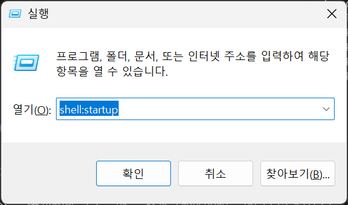
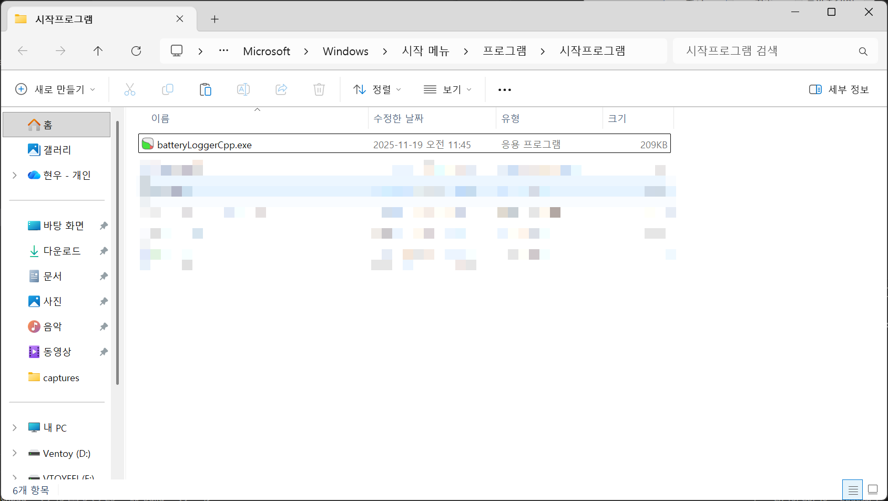

# batteryLoggerCpp


[](https://www.buymeacoffee.com/trgk)

`C:\Users\[Windows 계정 이름]\batteryLog.csv` 에 1분마다 배터리 로그를 기록합니다. 메모장이나 엑셀로 파일을 여실 수 있습니다.

- `time`: 기록 시간
- `plugged`: 노트북이 전원에 연결되어있었는지
- `percent`: 해당 시점에서 배터리 %
- `machine_id`: 노트북 고유번호. 윈도우가 깔린 SSD 하나를 여러 노트북에 옮겨다니면서 배터리타임을 측정할 때 등에 유용합니다.

### 예시 기록

```
time,plugged,percent,machine_id
2025-11-19T10:39:29,True,80,9721
2025-11-19T10:40:29,True,79,9721
2025-11-19T10:41:29,True,78,9721
2025-11-19T10:42:29,True,78,9721
2025-11-19T10:43:29,True,78,9721
2025-11-19T10:44:29,True,78,9721
2025-11-19T10:45:29,True,78,9721
2025-11-19T10:46:29,True,79,9721
2025-11-19T10:47:29,True,79,9721
2025-11-19T10:48:29,True,79,9721
2025-11-19T10:49:29,True,80,9721
2025-11-19T10:50:29,True,80,9721
2025-11-19T10:51:29,True,81,9721
2025-11-19T10:52:29,True,81,9721
2025-11-19T10:53:29,True,82,9721
2025-11-19T10:54:29,True,82,9721
2025-11-19T10:55:29,True,82,9721
```

## 자동 시작 방법

1. `Win+R` 로 실행 창을 키고 `shell:startup` 을 누르세요.
   
2. 열린 폴더에 `batteryLogCpp.exe` 를 집어넣으세요.
   
3. 윈도우 부팅 시마다 자동으로 batteryLoggerCpp가 실행됩니다.

# 후원

이 프로젝트가 유용하셨다면 커피 하나만 사주시면 감사하겠습니다 :)

[](https://www.buymeacoffee.com/trgk)

# 라이센스

GPLv3 라이센스 하에 배포됩니다.
